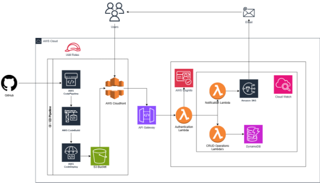


# **Table of Contents**
[Overview	3](#_toc173960844)

[Justification of Chosen AWS Services	3](#_toc173960845)

[AWS Services Utilization	4](#_toc173960846)

[Alternative Services	5](#_toc173960847)

[1. AWS Lambda vs. Amazon EC2	6](#_toc173960848)

[**2. Amazon DynamoDB vs. Amazon RDS**	6](#_toc173960849)

[**3. AWS API Gateway vs. Elastic Load Balancing**	6](#_toc173960850)

[**4. AWS Cognito vs. Amazon IAM**	7](#_toc173960851)

[**5. Amazon SNS vs. Amazon SES**	7](#_toc173960852)

[**6. Amazon S3 + Amazon CloudFront vs. Amazon EBS**	7](#_toc173960853)

[**7. AWS CodeBuild, CodeDeploy, CodePipeline vs. Jenkins**	7](#_toc173960854)

[**8. AWS CloudWatch vs. Datadog**	8](#_toc173960855)

[AWS Well-Architected Framework Application	8](#_toc173960856)

[Architectural Diagram	8](#_toc173960857)

[Architecture Overview	9](#_toc173960858)

[**1. Operational Excellence**	10](#_toc173960859)

[**2. Security**	10](#_toc173960860)

[**3. Reliability**	10](#_toc173960861)

[**4. Performance Efficiency**	11](#_toc173960862)

[**5. Cost Optimization**	11](#_toc173960863)

[Application Accessibility	12](#_toc173960864)

[Public URL	12](#_toc173960865)

#

# **Overview**
This report outlines the architectural decisions and justifications for the AWS services used in developing a quiz application. The application allows hosts to create and manage quizzes and participants to take quizzes without the need to log in. The system's architecture is designed for cost-effectiveness, performance, security, and scalability, adhering to the AWS Well-Architected Framework.
# **Justification of Chosen AWS Services**
> *Table 1: Services Used under Different Categories.*

|**AWS Service**|**Service Category**|**Justification for Use**|
| :- | :- | :- |
|**AWS Lambda**|Compute|Manages backend logic without server provisioning, enabling automatic scaling.|
|**Amazon DynamoDB**|Database|Provides a scalable NoSQL database with low latency data access.|
|**AWS API Gateway**|Networking & Content Delivery|Serves as the entry point for all API calls, offering throttling and monitoring.|
|**AWS Cognito**|Security, Identity, & Compliance|Handles user authentication and management, ensuring secure access.|
|**Amazon SNS**|Application Integration|Facilitates the sending of quiz codes and notifications via email efficiently.|
|**AWS CodeBuild**|Developer Tools|Automates code compilation and testing, ensuring the build's integrity.|
|**AWS CodeDeploy**|Developer Tools|Automates code deployments, enabling consistent and reliable application updates.|
|**AWS CodePipeline**|Developer Tools|Orchestrates steps in the software release process, from build to deployment.|
|**Amazon S3**|Storage|Stores static website content, providing durability and high availability.|
|**Amazon CloudFront**|Networking & Content Delivery|Distributes static content globally to reduce latency and improve load times.|
|**AWS CloudWatch**|Management & Governance|Monitors application health and logs, offering insights and alerts on operational issues.|
|**AWS IAM**|Security, Identity, & Compliance|Manages access control with policies for Lambda, DynamoDB, SNS, Cognito, and CodePipeline roles.|

## **AWS Services Utilization**
1. **AWS Lambda** [1]
   1. **Usage**: Handles all backend operations, including CRUD operations for quiz management by the creator and processing quiz attempts by participants.
   1. **Justification**: Lambda functions offer a serverless compute environment that reduces operational costs and scales automatically based on the demand, making it ideal for varying quiz operation loads.
1. **Amazon DynamoDB** [2]
   1. **Usage**: Stores data in two tables: one for quiz details and another for quiz scores.
   1. **Justification**: DynamoDB provides a fast, scalable NoSQL database solution that efficiently manages the storage and retrieval of quiz-related data, essential for the high-performance needs of real-time quiz interactions.
1. **AWS API Gateway** [3]
   1. **Usage**: Manages all API interactions between the React frontend and the backend Lambda functions.
   1. **Justification**: Ensures secure and efficient API traffic management, offering user authentication and data integrity while providing essential features like throttling to protect backend services.
1. **Amazon SNS** [4]
   1. **Usage**: Enables the quiz creator to send emails containing quiz links and codes to participants.
   1. **Justification**: SNS is vital for delivering messages reliably and flexibly, ensuring participants receive necessary information to access quizzes promptly.
1. **AWS Cognito** [5]
   1. **Usage**: Provides authentication services for the quiz creator.
   1. **Justification**: Ensures secure user sign-up and sign-in, managing sessions and credentials crucial for protecting access to the quiz management functions.
1. **Amazon S3** [6]
   1. **Usage**: Hosts the static components of the React application.
   1. **Justification**: S3 offers durable, secure, and scalable storage for static content, integrated with CloudFront for efficient content delivery, reducing load times and enhancing user experience.
1. **Amazon CloudFront** [7]
   1. **Usage**: Distributes the application’s static files globally.
   1. **Justification**: Reduces latency and improves responsiveness, essential when users are distributed worldwide.
1. **AWS CodeBuild, CodeDeploy, CodePipeline** [8]
   1. **Usage**: Automates the CI/CD pipeline, connecting to GitHub to fetch updates, build the application, and deploy updates to S3.
   1. **Justification**: These tools streamline development and deployment, ensuring continuous integration and delivery for quick and safe updates.
1. **AWS CloudWatch** [9]
   1. **Usage**: Monitors the performance of Lambda functions, API Gateway, and other involved services.
   1. **Justification**: Provides logging and monitoring, essential for maintaining application health, debugging, and optimizing performance based on usage data.

> *Table 2: Alternative services For the Current used services.*

|     Used Service     | Alternative Service |
| :------------------: | :-----------------: |
|     AWS Lambda       |     Amazon EC2      |
|   Amazon DynamoDB    |     Amazon RDS      |
|  AWS API Gateway     | Elastic Load Balancing |
|     AWS Cognito      |     Amazon IAM      |
|     Amazon SNS       |     Amazon SES      |
| Amazon S3 + Amazon CloudFront |     Amazon EBS      |
| AWS CodeBuild + CodeDeploy + CodePipeline |     Jenkins      |
|     AWS CloudWatch   |     Datadog         |

### 
###

### **1. AWS Lambda vs. Amazon EC2**
- **AWS Lambda** [1] automatically manages the compute fleet, offering a serverless architecture that scales on demand without requiring manual intervention. This is particularly beneficial for applications with variable and unpredictable workloads, like a quiz platform, where traffic can spike unpredictably due to new quizzes being released or popular quizzes drawing sudden interest.
- **Amazon EC2** [10], while flexible and powerful, requires setting up and managing virtual servers, including scaling, patching, and securing these servers. This adds a layer of complexity and administrative overhead that Lambda eliminates, making Lambda a more efficient choice for developers looking to focus more on application logic than infrastructure management.

**2. Amazon DynamoDB vs. Amazon RDS**

- **Amazon DynamoDB** [2] is a NoSQL database service that provides fast and predictable performance with seamless scalability. For a quiz application, which typically requires rapid reads and writes of relatively simple data structures (such as user scores and quiz metadata), DynamoDB's model is optimal. It offers built-in high availability and fault tolerance.
- **Amazon RDS** [11] is better suited for applications that require complex transactions with relational data, benefiting from SQL queries' capabilities. However, the overhead of managing relational database features (like schema updates and complex joins) may not be necessary for a quiz application, making DynamoDB a more streamlined and efficient choice.

**3. AWS API Gateway vs. Elastic Load Balancing**

- **AWS API Gateway** [3] provides a set of tools specifically designed for API management, including traffic management, CORS support, authorization and access controls, throttling, monitoring, and API version management. This makes it highly suitable for applications that are heavily reliant on APIs, as it simplifies both the deployment and the operational management of these APIs.
- **Elastic Load Balancing** [12] can distribute incoming network traffic across multiple targets, such as EC2 instances, in multiple Availability Zones, which increases the fault tolerance of applications. However, it lacks the API-specific features provided by API Gateway, making the latter more appropriate for handling the backend communications in a quiz application.

**4. AWS Cognito vs. Amazon IAM**

- **AWS Cognito** [5] offers comprehensive capabilities for handling user identities in web and mobile applications, including user registration, authentication, and user-specific data synchronization across devices. This makes it particularly useful for applications needing a robust, scalable solution for user management without additional backend infrastructure.
- **Amazon IAM** [13] manages access to AWS services and resources securely, but it is not designed to manage end-user authentication within applications. Cognito's focus on application-level security and identity management makes it the better option for controlling user access within the quiz platform.

**5. Amazon SNS vs. Amazon SES**

- **Amazon SNS** [4] allows messages to be sent to a large number of subscribers, including mobile devices, email addresses, and even HTTP/HTTPS endpoints, through a simple, highly scalable, and robust messaging infrastructure. This versatility is crucial for applications that may need to expand notification capabilities beyond email in the future.
- **Amazon SES** [14] is optimized for sending email and handling incoming email but lacks the broader messaging capabilities provided by SNS, such as sending SMS or mobile push notifications, which could limit communication flexibility in dynamic application scenarios.

**6. Amazon S3 + Amazon CloudFront vs. Amazon EBS**

- **Amazon S3** [6] combined with **Amazon CloudFront** [7] creates a powerful solution for storing and delivering static content globally with low latency and high transfer speeds. S3 provides durable infrastructure to store and retrieve any amount of data at any time, while CloudFront distributes it efficiently worldwide.
- **Amazon EBS** [15] provides persistent block storage volumes for use with Amazon EC2 instances but is not designed for direct static content hosting. For applications that require rapid, global access to static resources (like JavaScript files, images, and CSS for a quiz application), the combination of S3 and CloudFront is far more effective.

**7. AWS CodeBuild, CodeDeploy, CodePipeline vs. Jenkins**

- **AWS CodeBuild, CodeDeploy, CodePipeline** [8] provides a seamless integration with other AWS services, which simplifies the continuous integration and continuous deployment process. These services automate the code from build to production, ensuring a smooth deployment pipeline within the AWS ecosystem.
- **Jenkins** [16], while highly customizable and widely used, requires significant setup and maintenance of servers. If your stack is primarily AWS, utilizing AWS's native tools can reduce complexity and increase efficiency due to better integration and managed service offerings.

**8. AWS CloudWatch vs. Datadog**

- **AWS CloudWatch** [9] offers monitoring services that are tightly integrated with AWS, providing insights into application and infrastructure performance with metrics, logs, and events. This deep integration makes it ideal for monitoring AWS resources effectively without the need for additional configuration.
- **Datadog** [17] is a powerful monitoring tool that works across cloud services and offers extensive metrics and integrations. However, for AWS-specific resources, CloudWatch's native integration and capabilities provide streamlined monitoring solutions without the interoperability challenges that can arise with third-party tools.
# **AWS Well-Architected Framework Application**

## **Architectural Diagram**

*Figure 1: Cloud Architecture for the Application.*

The diagram illustrates the flow of data and interactions between different AWS services and the application components.
## **Architecture Overview**
My quiz application employs a serverless architecture, which means that the management, scaling, and patching of servers are handled by AWS, allowing you to focus on application development rather than infrastructure management. This approach is particularly effective in handling variable workloads, such as those experienced by a dynamic quiz platform where user traffic can fluctuate dramatically.

Additionally, the application is structured around microservices, where each service performs a specific function. This modular architecture enhances the scalability and flexibility of the application, making it easier to update and scale parts of the application independently without affecting the entire system.

> *Table 3: Justification of Cloud Architecture Pillars.*

|     **Pillar**     |   **AWS Services**   |     **Justification for Service Usage**     |
| :----------------: | :------------------: | :----------------------------------------: |
| Operational Excellence | AWS Lambda, AWS CloudWatch, AWS CodePipeline, AWS CodeBuild, AWS CodeDeploy | Lambda automates backend processes; CloudWatch monitors operations; CodePipeline, CodeBuild, and CodeDeploy automate deployment. |
| Security | AWS Cognito, AWS IAM, Amazon SNS | Cognito manages user authentication; IAM ensures secure access control; SNS securely sends notifications. |
| Reliability | AWS Lambda, Amazon DynamoDB, Amazon S3, Amazon CloudFront | Lambda and DynamoDB offer scalable, fault-tolerant performance; S3 and CloudFront ensure data availability and distribution. |
| Performance Efficiency | AWS Lambda, Amazon CloudFront, Amazon DynamoDB | Lambda offers efficient compute; CloudFront reduces latency; DynamoDB provides fast data retrieval. |
| Cost Optimization | AWS Lambda, Amazon DynamoDB, Amazon S3 | Lambda and DynamoDB use a pay-as-you-go model reducing costs; S3 offers cost-effective storage solutions. |
###

**1. Operational Excellence**

- **AWS Lambda** [1]: Enables automatic scaling and serverless operation, which significantly simplifies deployment and operational management. Lambda's event-driven nature ensures that resources are used only when needed, optimizing operational responsiveness and efficiency.
- **AWS CloudWatch** [9]: Acts as the central monitoring service for AWS resources and applications. It collects and tracks metrics, collects and monitors log files, sets alarms, and automatically reacts to changes in AWS resources, which helps in maintaining operational health.
- **AWS CodePipeline** [8], **AWS CodeBuild** [8], **AWS CodeDeploy** [8]: These services automate the software release process from build to deployment, which enhances operational excellence by enabling quick updates and reducing the chances for errors in manual processes. CodePipeline orchestrates the workflow, CodeBuild compiles source code and runs tests, and CodeDeploy automates the deployment to AWS services.

**2. Security**

- **AWS Cognito** [5]: Provides user authentication and mobile user-specific features such as sign-up, sign-in, and security against unauthorized access. Cognito integrates seamlessly with frontend applications to manage user sessions securely.
- **AWS IAM** [13]: Manages access to AWS services and resources securely. Using IAM, you can create and manage AWS users and groups, and use permissions to allow and deny their access to AWS resources, which is fundamental in protecting your backend infrastructure.
- **Amazon SNS** [4]: Enables the application to send notifications securely and reliably. SNS provides encrypted message queues for secure transmission and immediate message delivery, which is critical when sending codes and links for quiz participation.

**3. Reliability**

- **AWS Lambda** [1], **Amazon DynamoDB** [2]: Both services offer built-in fault tolerance. Lambda runs code with automatic scaling and failover, and DynamoDB provides reliable performance at any scale with built-in high availability.
- **Amazon S3** [6], **Amazon CloudFront** [7]: S3 provides durable storage architecture designed for mission-critical and primary data storage. CloudFront, a global content delivery network, delivers data with high transfer speeds to end users with low latency, ensuring the application's availability and performance.

**4. Performance Efficiency**

- **AWS Lambda** [1]: Offers high-performance computing capabilities with scalability and flexibility without the overhead of managing physical servers.
- **Amazon CloudFront** [7]: Improves the performance of web applications by delivering content from locations closest to the user, reducing latency.
- **Amazon DynamoDB** [2]: Provides fast and predictable performance with the scalability needed to handle high request rates and large amounts of data, essential for dynamic quiz interactions.

**5. Cost Optimization**

- **AWS Lambda** [1]: The pay-as-you-go model aligns operational costs directly with actual usage, avoiding over-provisioning or underutilization.
- **Amazon DynamoDB** [2]: Offers a cost-efficient solution for databases with its on-demand capacity mode, which charges for the write and read throughput that you consume.
- **Amazon S3** [6]: Provides cost-effective object storage with industry-leading scalability, data availability, security, and performance. This allows paying only for what you use without requiring large upfront investments.

## **Application Accessibility**
**Public URL**: <http://krishnaquizapp1.s3-website-us-east-1.amazonaws.com/> 

**Code Repository (GitHub)**: <https://github.com/KrishnaVaibhav/Quizz_App>  

This URL points to the hosted application, accessible worldwide, demonstrating the application’s functionality and responsiveness.

